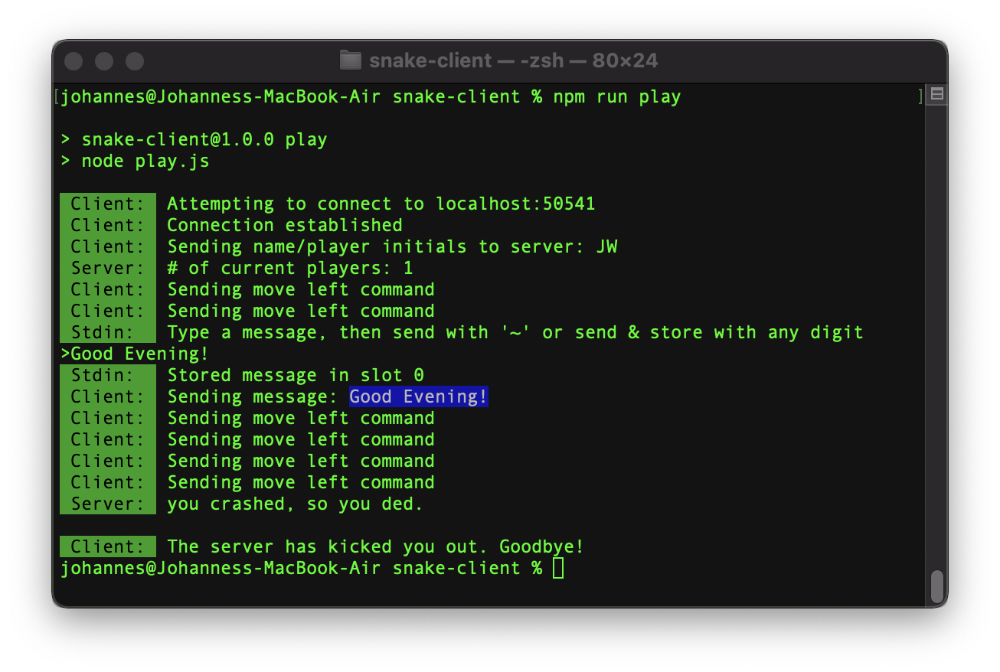

# Snake Client
A client for the Lighthouse Labs [snek-multiplayer](https://github.com/lighthouse-labs/snek-multiplayer) Snake server.

_To take advantage of all the features of this client, you can use [my fork of the LHL Snake server repo](https://github.com/jowe81/snek-multiplayer), which supports broadcast messages._

If you don't know Snake: it's a very popular video game classic. The player maneuvers a dot and grows it by ‘eating’ pieces of food. As it moves and eats, it grows and the growing snake becomes an obstacle to smooth maneuvers. The goal is to grow it to become as big as possible without bumping into the side walls, or bumping into itself, upon which it dies. This is a multiplayer take on the genre.

## Features:

### Navigation
* Navigate your snake with the `w`, `a`, `s`, `d` keys, _or_
* configure your own key bindings

### Messages
* Send a canned message to other players by hitting any digit (`0` - `9`)
* Hit `~` to compose a free-text message
  * When done typing, hit `~` again to send and then discard the free-text message, _or_
  * Hit any digit (`0` - `9`) to send and store the free-text message in the respective slot.

### Console Feedback
* The client will log all activity to the console
* If supported by the server, the client will display the following broadcast messages:
  * A new player logging on
  * A player setting/changing their name
  * Crashes and collisions with player names
  * A player otherwise leaving the game

## Instructions
### Install it:
```bash
git clone https://github.com/jowe81/snake-client
cd snake-client
npm install
```
If you haven't already, install and start a Snake server (see [top of this file](#snake-client) for options).

### Configure it:
* Visit the configuration file, ```constants.js```, to edit your name, connection information, key bindings, and canned messages.
* Note that command line arguments take precedence over settings in ```constants.js```.

### Run it:
```bash
npm run play
```
With optional command line arguments:
```bash
npm run play -- [-name yourName] [-ip serverAddress] [-port portNumber]
```
Terminate the client with `q` (default binding) or good old `CTRL + C`.

## Screenshot


## Dependencies
* [chalk ^4.1.2](https://www.npmjs.com/package/chalk)